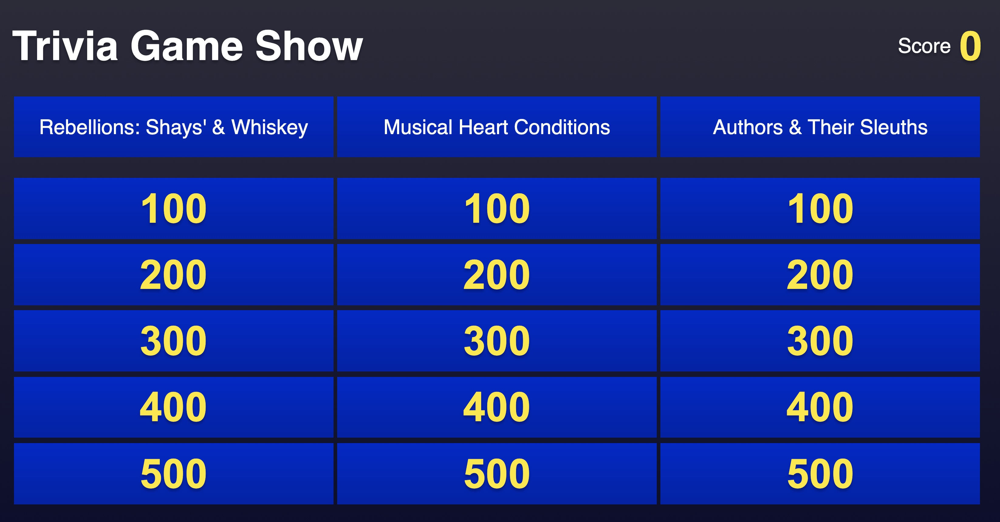

# Coding 101 Exercise

    

To build the Jeopardy game, you are going to be writing a couple of helper functions in the empty `exercise.js` file. More information is provided below regarding the functions you must write, and the documentation regarding some of the helper functions you can use.

 

## Helper Functions

**Function Name**: `fetchCategories`

**Input(s)**: It only takes a single integer parameter, which specifies the amount of categories you want to request for.

**Output(s)**: An array containing your requested amount of categories.

 

**Function Name**: `fetchQuestions`

**Input(s)**: It only takes a single parameter. This parameter is a single category from the array of categories that you got above.

**Output(s)**: An array containing the questions for the specified category.

 

**Function Name**: `addToGame`

**Input(s)**: This function takes two parameters. First parameter is the list of categories, and the second parameter is the list of questions.

**Output(s)**: This function doesn't return anything.

 

## Exercise Instructions

> Here is the specification of the functions you will be required to write in the `exercise.js` file to create the game.

**Function Name**: `getQuestions`

**Input(s)**: It only takes a single parameter. This parameter is an array of categories.

**Output(s)**: An array containing questions for all categories in the input array.

**Description:** The function should iterate over all categories in the array provided in the parameter, and it should use the `fetchQuestions` helper function to ask for the questions for each category. These questions should be stored in an array, which is returned by the function.

 

**Function Name**: `addCategoriesToGame`

**Input(s)**: This function takes no input parameters.

**Output(s)**: This function doesn't return anything.

**Description:** The function should firstly get your desired number of categories using the `fetchCategories` helper function. Thereafter, use your custom function `getQuestions` to request for questions for your categories. After doing this, finally call the `addToGame` to add all your data to the game.